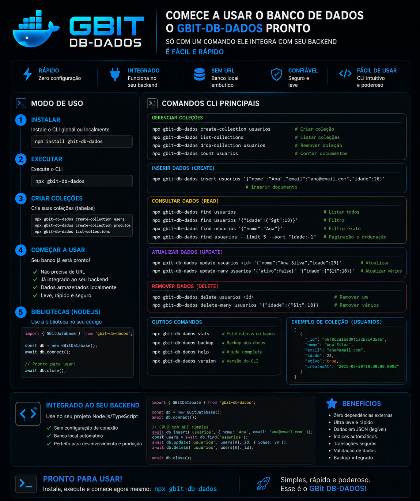

<p align="center">
  
</p>

<p align="center">

  
  
  
  
  
  
  
  
  

</p>


<svg width="720" height="150" viewBox="0 0 720 150" fill="none" xmlns="http://www.w3.org/2000/svg" role="img" aria-label="gbit-db-dados">
  <!-- ═══ ICON BADGE ═══ -->
  <rect x="20" y="15" width="120" height="120" rx="26" fill="#21261F"/>

  <!-- back index card -->
  <rect x="46" y="42" width="56" height="70" rx="7"
        fill="#F2E9D8" opacity="0.55"
        transform="rotate(-9 74 77)"/>

  <!-- front index card -->
  <rect x="58" y="46" width="56" height="70" rx="7"
        fill="#FAF5E9" stroke="#21261F" stroke-width="1"
        transform="rotate(4 86 81)"/>

  <!-- data lines on front card -->
  <g transform="rotate(4 86 81)">
    <rect x="68" y="62" width="34" height="4" rx="2" fill="#8B8975"/>
    <rect x="68" y="74" width="26" height="4" rx="2" fill="#8B8975"/>
    <rect x="68" y="86" width="30" height="4" rx="2" fill="#B23A2E"/>
    <rect x="68" y="98" width="18" height="4" rx="2" fill="#3B6E4F"/>
  </g>

  <!-- atomic-write accent dot -->
  <circle cx="132" cy="27" r="8" fill="#B23A2E"/>
  <circle cx="132" cy="27" r="8" fill="none" stroke="#F2E9D8" stroke-width="2"/>

  <!-- ═══ WORDMARK ═══ -->
  <text x="168" y="97" font-family="Georgia, 'Times New Roman', serif" font-size="54" letter-spacing="-1.5">
    <tspan font-weight="700" fill="#21261F">gbit</tspan>
    <tspan fill="#B23A2E" dx="6">·</tspan>
    <tspan font-weight="700" fill="#B23A2E" dx="6">db</tspan>
    <tspan fill="#B23A2E" dx="6">·</tspan>
    <tspan font-weight="500" fill="#565C4E" dx="6">dados</tspan>
  </text>

  <!-- tagline -->
  <text x="170" y="122" font-family="'Courier New', monospace" font-size="13" letter-spacing="1.5"
        fill="#8B8975">
  ## Integrar No Seu  Backend facil e rapido
  </text>
</svg>

#  GBIT DB dados
# gbit-db-dados

GBIT DB Dados

📦 [Pacote no NPM](https://www.npmjs.com/package/gbit-db-dados) · 💻 [Repositório no GitHub](https://github.com/Gislaine-web3)

**Banco de dados criação própria do Gbit — moderno, leve e sem dependências externas.**

O `gbit-db-dados` é uma alternativa moderna a bancos como **PostgreSQL**, **MySQL** e **MongoDB**. Ele roda 100% em cima do Node.js e do sistema de arquivos local — sem precisar instalar servidor de banco, sem Docker, sem serviço externo rodando em background. Só instalar o pacote e usar.

Feito para ser **rápido, previsível e fácil de integrar em qualquer projeto backend** — APIs REST, CLIs, apps Electron/desktop, protótipos, microsserviços e sistemas de pequeno/médio porte que não precisam da complexidade (nem do custo de infraestrutura) de um SGBD tradicional.

> Onde antes você precisaria subir um Postgres, configurar um MySQL ou depender de um cluster MongoDB, o `gbit-db-dados` entrega o essencial de um banco de verdade — CRUD, índices, schema, validação e transações — direto no seu projeto, sem nenhuma peça de infraestrutura extra.

---

## ✨ Por que usar

| | |
|---|---|
| 🚀 **Zero dependências** | Usa só módulos nativos do Node (`fs`, `crypto`, `path`). Nada para instalar além do próprio pacote. |
| 💾 **Armazenamento local em arquivos** | Seus dados ficam em JSON legível no seu próprio projeto — sem servidor externo, sem rede, sem senha de conexão. |
| ⚡ **Escrita atômica** | Toda gravação é feita em arquivo temporário e só então renomeada — protege contra corrupção em caso de crash ou queda de energia. |
| 🔍 **Índices reais** | Lookups O(1) em campos indexados (como e-mail único), em vez de varrer todos os documentos. |
| 🧠 **Schema + validação** | Tipos, campos obrigatórios, `unique`, `min`/`max`, `enum`, validação de e-mail — sem precisar de biblioteca extra. |
| 🔁 **Transações com rollback** | Operações em múltiplas coleções com garantia de tudo-ou-nada. |
| 🖥 **CLI + biblioteca** | Use pelo terminal para prototipar rápido, ou importe direto no seu código com `require('gbit-db-dados')`. |
| 📦 **Roda em qualquer lugar** | Backend Node.js, apps desktop (Electron), scripts, ferramentas internas — se roda Node, roda `gbit-db-dados`. |

<p align="center">
  
</p>

<p align="center">

  
  
  
  
  
  
  
  
  
  

</p>


---

## 📦 Instalação

```bash
npm install gbit-db-dados
```

Ou, para usar a CLI globalmente:

```bash
npm install -g gbit-db-dados
```

```bash
npx gbit-db-dados
```

---

## 🚀 Comandos rápidos (CLI)

```bash
# cria um banco de dados novo na pasta atual
gbit-db-dados init ./meu-banco
cd meu-banco

# cria uma coleção
gbit-db-dados create-collection users

# insere um documento
gbit-db-dados insert users '{"email":"a@a.com","name":"Ana"}'

# lista todas as coleções e quantos documentos cada uma tem
gbit-db-dados list-collections

# busca documentos (filtro opcional em JSON)
gbit-db-dados find users '{"name":"Ana"}'

# conta documentos que casam com um filtro
gbit-db-dados count users

# mostra estatísticas do banco (coleções, índices, contagens)
gbit-db-dados stats

# cria um backup de todas as coleções
gbit-db-dados backup

# remove uma coleção inteira
gbit-db-dados drop-collection users

# versão instalada
gbit-db-dados version

# ajuda com todos os comandos
gbit-db-dados help
```


## ⚠️ Importante: depois de criar coleções  se der erros 

Depois de criar ou alterar coleções no **gbit-db-dados**, rode na **raiz do projeto**:

```bash
npm run build
```

Sem isso, o projeto não reconhece as coleções novas. É o único passo manual do fluxo — todo o resto sobe sozinho.


---

## Biblioteca do motor Gbit-db-dados 

## 🧑‍💻 Comandos rápidos (código / biblioteca)

```js
const gbit = require('gbit-db-dados');

// abre (ou cria, se não existir) um banco de dados
const db = gbit.open('./meu-banco');

// cria uma coleção com schema e validação
const users = db.collection('users', {
  name:  { type: 'string', required: true, minLength: 2 },
  email: { type: 'string', required: true, unique: true, format: 'email' },
  age:   { type: 'number', min: 0 },
});

// CREATE
const user = users.insert({ name: 'Ana', email: 'ana@ex.com', age: 30 });

// READ
users.findById(user._id);
users.find({ age: { $gte: 18 } });
users.findByIndex('email', 'ana@ex.com'); // lookup O(1)
users.query().where({ active: true }).sort('age', 'desc').limit(10).exec();

// UPDATE
users.updateById(user._id, { age: 31 });

// DELETE
users.deleteById(user._id);

// TRANSAÇÃO (tudo ou nada)
db.transact(() => {
  users.insert({ name: 'Bia', email: 'bia@ex.com' });
  users.insert({ name: 'Caio', email: 'caio@ex.com' });
});

// BACKUP
db.backup();
```

### Operadores de consulta disponíveis

| Operador | Exemplo |
|---|---|
| igualdade | `{ status: 'active' }` |
| `$gt` / `$gte` | `{ age: { $gte: 18 } }` |
| `$lt` / `$lte` | `{ age: { $lt: 65 } }` |
| `$ne` | `{ status: { $ne: 'banned' } }` |
| `$in` / `$nin` | `{ role: { $in: ['admin', 'editor'] } }` |
| `$regex` | `{ name: { $regex: '^A' } }` |
| `$exists` | `{ deletedAt: { $exists: false } }` |
| `$or` / `$and` | `{ $or: [{ a: 1 }, { b: 2 }] }` |

---

## 📁 Como os dados ficam salvos

```
meu-banco/
├── database.json        # metadados do banco
├── metadata.json         # schema e índices de cada coleção
├── collections/
│   ├── users.json        # documentos da coleção "users"
│   └── orders.json
├── indexes/
├── transactions/          # log de cada transação (committed / rolled_back)
└── backups/                # snapshots gerados por "backup"
```

Tudo em texto legível — você pode abrir, ler e até editar os arquivos manualmente se precisar.


---

## Licença

MIT

## Banco de dados: `gbit-db-dados` integrado ao backend

<p align="center">
  
</p>

O `gbit-db-dados` roda dentro do próprio `gbit-database` — não é um serviço separado que você precisa conectar. Assim que o servidor sobe na porta `4200`, o banco já está funcionando.


# gbit-db-dados

Banco de dados **NoSQL local, orientado a arquivos**, 100% Node.js puro.
Sem PostgreSQL, sem MongoDB, sem Docker, sem servidor externo — apenas o
filesystem. Ideal para CLIs, protótipos, apps desktop/Electron, scripts,
testes e backends pequenos/médios que não precisam de um SGBD dedicado.

```
npm install gbit-db-dados
```

- ⚡ **Zero dependências** — só usa módulos nativos do Node (`fs`, `crypto`, `path`, `http`).
- 💾 **Escrita atômica** — grava em arquivo temporário e renomeia, evitando corrupção em caso de crash.
- 🔍 **Índices reais** — lookups O(1) em campos indexados (ex: e-mail único), em vez de varrer tudo.
- 🧠 **Schema + validação** — tipos, campos obrigatórios, `unique`, `min/max`, `enum`, formato de e-mail.
- 🔁 **Transações com rollback** — tudo-ou-nada entre múltiplas coleções.
- 🖥 **CLI completo** — crie, consulte e inspecione bancos direto do terminal.
- 📦 **Também é uma biblioteca** — `require('gbit-db-dados')` no seu backend.

---

## Estrutura do projeto

```
gbit-db-dados/
├── bin/gbit-db-dados.js         # executável da CLI
├── lib/
│   ├── cli/                     # comandos, help, versão
│   ├── engine/                  # Database, Collection, Query, Index, Transaction
│   ├── storage/                 # Storage, Serializer, FileManager (I/O atômico)
│   ├── schema/                  # Schema, Validator
│   ├── utils/                   # id, logger, paths
│   └── index.js                 # API pública da lib
├── templates/database/          # esqueleto de um banco novo
├── examples/login-backend.js    # backend de login completo (ver abaixo)
└── test/                        # suíte de testes (node:test nativo)
```

## Como um banco fica no disco

```
meu-banco/
├── database.json          # metadados do banco (nome, versão, criado em)
├── metadata.json           # schema + índices de cada coleção
├── collections/
│   ├── users.json          # documentos da coleção "users"
│   └── orders.json
├── indexes/                 # (reservado para índices persistidos em disco)
├── transactions/            # log de cada transação (committed / rolled_back)
└── backups/                 # snapshots criados por `backup`
```

---

## Uso via CLI para projetos externos 

```bash
# cria um banco na pasta atual
gbit-db-dados init ./meu-banco
cd meu-banco

gbit-db-dados create-collection users
gbit-db-dados insert users '{"email":"a@a.com","name":"Ana"}'
gbit-db-dados find users '{"name":"Ana"}'
gbit-db-dados count users
gbit-db-dados stats
gbit-db-dados backup antes-da-migracao
gbit-db-dados help
```

## Uso como biblioteca

```js
const gbit = require('gbit-db-dados');

const db = gbit.open('./meu-banco'); // cria se não existir

const users = db.collection('users', {
  name:  { type: 'string', required: true, minLength: 2 },
  email: { type: 'string', required: true, unique: true, format: 'email' },
  age:   { type: 'number', min: 0 },
});

const user = users.insert({ name: 'Ana', email: 'ana@ex.com', age: 30 });

users.findById(user._id);
users.find({ age: { $gte: 18 } });
users.findByIndex('email', 'ana@ex.com'); // lookup O(1) via índice único
users.updateById(user._id, { age: 31 });
users.deleteById(user._id);

// consultas encadeadas
users.query().where({ active: true }).sort('age', 'desc').limit(10).exec();

// transação: tudo ou nada
db.transact(() => {
  users.insert({ name: 'Bia', email: 'bia@ex.com' });
  users.insert({ name: 'Caio', email: 'caio@ex.com' });
});
```

### Operadores de consulta suportados

| Operador   | Exemplo                                  |
|------------|-------------------------------------------|
| igualdade  | `{ status: 'active' }`                    |
| `$gt/$gte` | `{ age: { $gte: 18 } }`                   |
| `$lt/$lte` | `{ age: { $lt: 65 } }`                    |
| `$ne`      | `{ status: { $ne: 'banned' } }`           |
| `$in/$nin` | `{ role: { $in: ['admin','editor'] } }`   |
| `$regex`   | `{ name: { $regex: '^A' } }`              |
| `$exists`  | `{ deletedAt: { $exists: false } }`       |
| `$or/$and` | `{ $or: [{a:1},{b:2}] }`                  |

---

## Exemplo real: backend de login (`examples/login-backend.js`)

Um servidor HTTP puro (sem Express) com registro, login, sessão via token e
rota autenticada — tudo persistido pelo gbit-db-dados:

```bash
node examples/login-backend.js
# ✓ Login backend rodando em http://localhost:3000
```

```bash
# registrar
curl -X POST localhost:3000/register \
  -d '{"email":"a@a.com","password":"senha123","name":"Ana"}'

# login (retorna token de sessão)
curl -X POST localhost:3000/login \
  -d '{"email":"a@a.com","password":"senha123"}'

# rota protegida
curl localhost:3000/me -H "Authorization: Bearer <token>"

# logout (invalida o token)
curl -X POST localhost:3000/logout -H "Authorization: Bearer <token>"
```

O exemplo mostra na prática:
- Senhas nunca armazenadas em texto puro — hash com `crypto.scryptSync` + salt aleatório por usuário, comparação com `timingSafeEqual` (evita timing attack).
- `email` como campo **único indexado** → login faz `findByIndex('email', ...)`, um lookup O(1), não uma varredura.
- Coleção `sessions` separada, com expiração de token (TTL) e limpeza automática de sessões expiradas.
- Erros de validação (`ValidationError`) e duplicidade (`DuplicateKeyError`) tratados com status HTTP corretos (400/401/409).

---

## API de referência (resumo)

**`Database`**
`Database.init(root)` · `Database.open(root)` · `db.collection(name, schema?)` · `db.listCollections()` · `db.dropCollection(name)` · `db.transaction()` / `db.transact(fn)` · `db.backup(label?)` · `db.stats()`

**`Collection`**
`insert(doc)` · `insertMany(docs)` · `find(filter)` · `findOne(filter)` · `findById(id)` · `findByIndex(field, value)` · `query()` · `count(filter)` · `all()` · `updateById(id, patch)` · `update(filter, patch)` · `deleteById(id)` · `delete(filter)` · `clear()` · `createIndex(field, {unique})` · `stats()`

**Erros**: `ValidationError`, `DuplicateKeyError`, `NotFoundError` — todos com `.name` identificável para tratamento em `try/catch`.

---

## Rodando os testes

```bash
npm test
```

20 testes cobrindo storage atômico, CRUD, schema/validação, unicidade,
consultas com operadores, persistência entre reaberturas, transações
(commit e rollback) e backup.

## Licença

MIT

## autor 
gislainelophes@gmail.com
